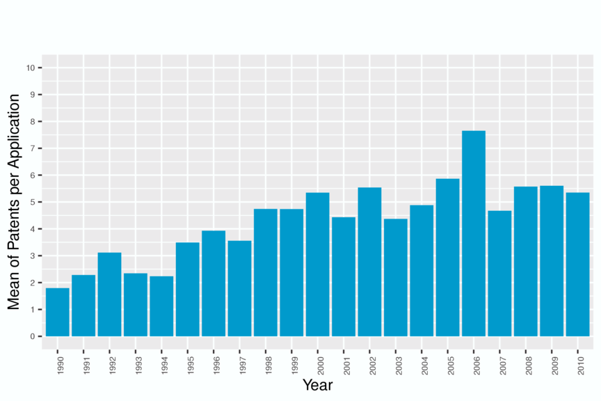
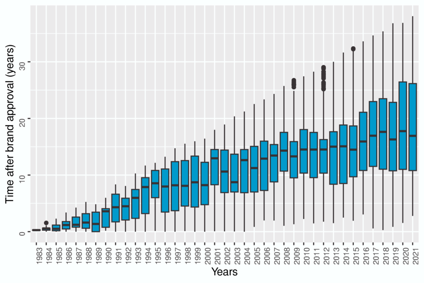
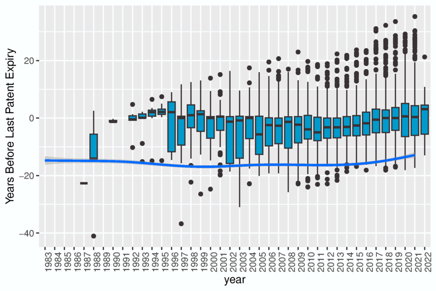
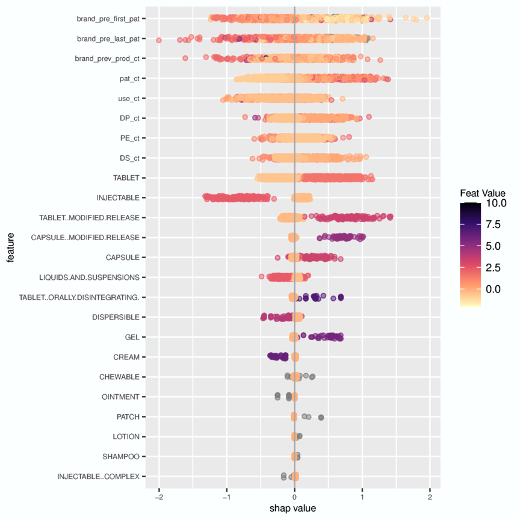
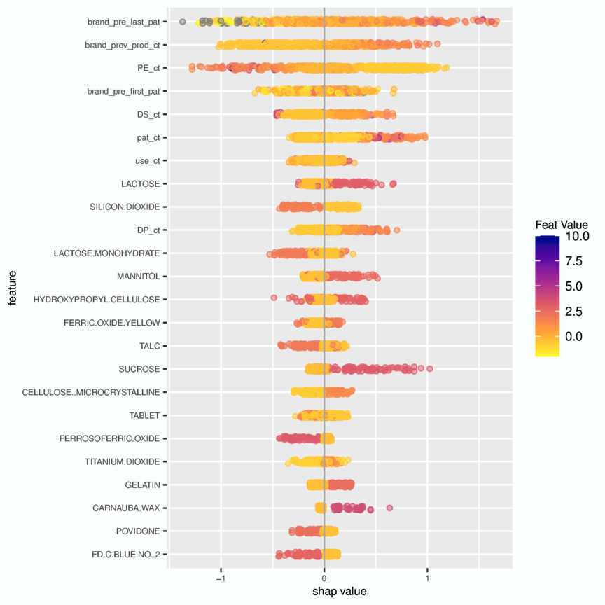
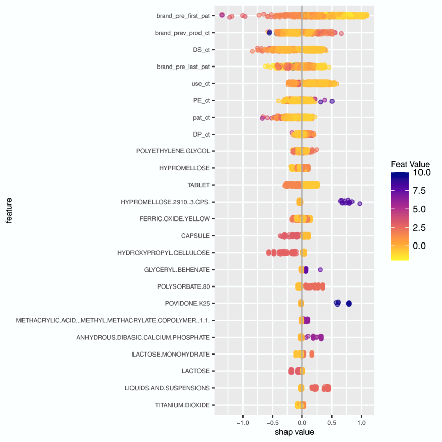

# GenRxPredict: Analyzing Pharmaceutical Patents and Time-to-Market for Prediction of Generic Product Competition

## A Thesis Presented for the Master of Data Science and Analytical Storytelling from Truman State University (Kirksville, MO)

Full text is available [here](https://github.com/Marmuvar/GenRxPredict/blob/main/Benmuvhar-Classification%20of%20Generic%20Manufacturers%20and%20Competition%20in%20the%20Pharmaceutical%20Industry.pdf)  

The following overview abridges key strategies from the thesis.  

## Overview  

The United States Pharmaceutical Industry provided almost 194 billion daily doses of pharmaceuticals in 2021, representing around \$776 billion in wholesale costs and \$80 billion in patient out-of-pocket costs (IQVIA, 2022). Pharmaceuticals enter commercial trade after the Food and Drug Administration (FDA) issues a marketing authorization based on either a new drug application (NDA) for a novel (“branded”) drug product or an abbreviated new drug application (ANDA) for a generic drug product. An NDA documents extensive studies of safety and efficacy for the drug molecule and the drug product and can represent over a billion dollars of development costs and over a decade of research expenditures (Sun et al, 2022).
In contrast, a generic sponsor of an ANDA does not need to prove safety and efficacy through clinical trials.  Instead, they demonstrate “therapeutic equivalency” to the branded product through a small clinical study in volunteers showing that there are no differences in the rate or amount of drug absorbance into the body.  Further, the products must be pharmaceutically equivalent by having the same active pharmaceutical ingredient, same dosage form, same strengths, and same route of administration.  (Center for Drug Evaluation and Research (CDER), 2017). Since clinical effectiveness is a function of drug concentration, demonstration of similar drug concentrations makes it unnecessary for generic products to duplicate extensive clinical performance trials required for branded product approval (Midha & McKay, 2009).  As a result, two to five years of generic drug development might only cost around $2.5 to 5 million dollars, or around 1/400th the cost of the branded pharmaceuticals.
The 1984 Drug Price and Competition Act balanced the intellectual property rights of innovative brand pharmaceuticals with a regulatory framework for generic product development.   Novel products became eligible for additional exclusivity periods and extensions to the twenty years of patent protection based on regulatory review time.  In exchange, the brand companies could not pursue litigation against a generic pharmaceutical company for patent infringement until after an ANDA was submitted.  Generic drug companies gained the right to pursue necessary clinical and development studies without risk of patent infringement litigation.  

Generic competition erodes drug price.   The first generic product to market is sold at a significant discount.  After 6 or more competitors, the price is as little as 95% of wholesale cost (Conrad and Lutter, 2019). 

Many companies who are approved to make a drug no longer market the product.  Declining drug price and low contribution to company revenue were correlated with drug product shortages between 2013 and 2017 (FDA, 2019).

The average number of patents for each approved new drug product has steadily increased since the Drug Price and Competition Act was passed in 1984. Because patent expiry dates may be staggered due to regulatory agreements, the increased number of patents provide opportunity for brands to extend the period without generic competition.  In parallel, the median time between generic and brand approval has also increased.  This may reflect both time elapsed while waiting for patents to expire and generic companies finding profitability in older drug products.  While many generics are approved in the year following patent expiry, a large majority are approved in the years preceding expiry.  

### Mean Patent Count for Each Brand Product  

 

### Time of Generic Approval from Brand Approval Date
 

### Time of Generic Approval vs. Last Brand Patent Expiry Date

## Objective  

Given the benefits provided by generic product availability and the risk associated with bringing new products to market, I wanted to understand:  

* Do patents, dosage forms, ingredients, and packaging provide a basis for predicting generic competition?  
* Can generic competition be predicted relative to patent expiration?  

## Data 

### Approved Drug Products with Therapeutic Equivalence Evaluations. 25th to 42nd Editions.  

Each year, the FDA publishes the commonly referenced “Orange Book”, an official record  of drug products approved for marketing in the United States. Further, it specifies the relationship between the original drug products and equivalent generics. Claimed patent protections and regulatory exclusivity in effect for each drug product application are also listed.  While an electronic version is available, details of patents and bioequivalence categories are retired as patents expire or products are discontinued.  Therefore, historical PDF versions were required.  

### Structured Product Labels  

Each approved drug product carries an exhaustive labeling of ingredients, packaging, dosing instructions, clinical studies, side effects and other information.  The FDA requires all labels to follow a standardized XML format, which facilitates consistent extraction of data fields.  The National Library of Medicine maintains the comprehensive repository of labels for all currently marketed products.  

## Data Processing

For product application and patent records, custom modules were written in Python to parse and clean data following PDF conversion using modules from pypdf2 and tabula.  For product labels, custom modules written in Python processed the data after using element.etree to parse the XML structures.

## Methodology  

Data sets were formed comprising of features including counts of patents, the offset between brand approval and patent expiry, dosage forms, ingredients, and packaging components.  Products were filtered to include brand products with patent expiry dates between 1990 and 2010, which ensured time for generic products to reach market.  Each brand product was categorized as to whether any generic product was approved before the first or last patent expiry. 

Training sets were formed from 70% of the samples, and minority classes were up-sampled to 50%  Data were scaled between 0 and 1 based on minimum and maximum values.  

All analysis was performed in R implementing packages available from CRAN, including xgboost for boosted gradient analysis, e1071 for support vector machine analysis, and rpart for decision tree analysis.  

## Results

### Boosted Gradient | Baseline Features | Competition before Last Patent Expiry | Multiple Administration Routes  

Overall model accuracy was statistically significant (greater than no-information rate (NIR).  When baseline patent features were supplemented with product ingredients, incremental improvement in accuracy was observed.  

In general, brand products approved well-before first patent expiry were more likely to have generic competition before its final patent expired.  While tablet dosage forms were more likely to have generic competition, a liquid or injectable dosage form predicted an absence of early competition.

Low previous product count a predictor of absence of competition
Presence of water predicts absence of competition.   This aligns with injectables and liquid observation
Common tablet ingredients (crospovidone, starch, and mannitol) predict absence of competition
Other common tablet ingredients (magnesium stearate, hypromellose, lactose monohydrate) predict competition

 

### Boosted Gradient | Baseline Features | Competition before Last Patent Expiry | Oral Administration Routes  

 

Shorter times before first patent expiry predictive of absence of competition. This is intuitive, as several years are required for generic product development.  A high number of patents, howver, is predictive of competition, while a high number of exclusivities predicts the absence of competition.  Among the ingredients, sucrose, mannitol, and hydroxypropyl cellulose predict competition, while lactose, talc, and several colorants predict an absence of competition.  All of these ingredients are common.  With the exception of hydroxypropyl cellulose, none would indicate a complex dosage form.      

### Boosted Gradient | Baseline Features | Competition before First Patent Expiry | Oral Administration Routes  

Longer times before first patent expiry predictive of absence of competition.  Hydroxypropyl cellulose is predictive of absence of competition.  Depending on grade, it can be associated with more complicated tablet formulations.  Polysorbate 80 and polyethylene glycol can be found in liquid formulations.  In this model, they are predictive of the presence of competition. 

## Limitations and Further Studies  

Market dynamics influence product selection.  While the models have limited predictive accuracy arising from trends in historical patent and formulation data, greater accuracy might be gained by including sales revenue and volume data.

The machine learning algorithms used in the study are influenced by hyperparameters, a selection of calculation variables and criteria.  While these parameters were tuned using a limited test set of data, they were broadly applied to multiple sets of variables.  Additional tuning studies with each variable set could change model accuracy and precision.  

Finally, due to expansion and consolidation in the pharmaceutical industry, certain assumptions were made about the provenance of products and companies.  For example, company incorporation status (e.g. "inc", "ltd") was removed from names.   This may discount business units that were operationally independent from more experienced parts of a corporation.  Similarly, no attempt was made to address corporate name changes arising from re-branding, such as Valeant becoming Bausch Healthcare in 2018.   This could limit the perceived experience a company has with certain dosage forms.  

## Conclusions

Overall, the study has justified the importance of predicting competition in the generic pharmaceutical industry.  Custom modules were built to successfully extracted and compile data from a multi-volume annual report in PDF format.  Last, models predicted competition before first and last patent expiry using data derived from the FDA Orange Book and product labels.  

## Required Packages
See [package bibliography](packages.bib)

## Compilation 

After cloning repository, run bookdown::render_book() from the repository root directory.
Individual code sections can then be explored within _main.rmd generated from the command.

## Bibliography
See [bibliography](book.bib)

Beall, R., Darrow, J., & Kesselheim, A. (2018). A method for approximating future entry of generic drugs. Value in Health, 21(12), P1382–1389. https://doi.org /10.1016/j.jval.2018.04.1827  
Branco, P., Torgo, L., & Ribeiro, R. P. (2016). A survey of predictive modeling on imbalanced domains. ACM Computing Surveys (CSUR), 49(2), 1–50.  
Buckley, L. A., Bebenek, I., Cornwell, P. D., et al. (2020). Drug development 101: A primer.  International Journal of Toxicology, 39(5), 379–396. https://doi.org/10.1177/1091581820939083  
Carrier, M., Lemley, M., & Miller, S. (2020). Playing both sides? branded sales, generic drugs, and antitrust policy. Hastings Law Journal, 71, 2. https://repository.uchastings.edu/hastings_law_journal/vol71/iss2/3  
Center for Biologics Evaluation and Research, Center for Drug Evaluation and Research, and Center for Vetrinary Medicine. (2018). Structured product labeling (spl) implementation guide with validation procedures (tech. rep.). U.S. Department of Health, Human Services, Food, and Drug Administration. https://www.fda.gov/media/8420 1/download  
Center for Drug Evaluation and Research. (1998). Guidance for industry: Variations in a drug product that may be included in a single anda, U.S. Department of Health, Human Services, Food, and Drug Administration. https://www.fda.gov/files/drugs/published/Variations-in-Drug-Products-that-May-Be-Included-in-a-Single-ANDA.pdf  
Center for Drug Evaluation and Research (CDER). (2017). What is the approval process for generic drugs, U.S. Department of Health, Human Services, Food, and Drug Administration. https://www.fda.gov/drugs/generic-drugs/what-approval-process-genericdrugs  
Chen, T., & Guestrin, C. (2016). Xgboost: A scalable tree boosting system. In Proceedings of the 22nd ACM SIGKDD International Conference on Knowledge Discovery and Data Mining, 785–794. Comittee on Professional Ethics of the American Statistical Association. (2018). Ethical guidelines for statistical practice. https://www.amstat.org/asa/files/pdfs/EthicalGuidelines.pdf  
Congressional Budget Office. (2021). Research and development in the pharmaceutical industry (tech. rep.). https://www.cbo.gov/publication/57025  
Congressional Research Service. (2021). Drug prices: The role of patents and regulatory exclusivities (tech. rep.). https://crsreports.congress.gov/product/pdf/R/R46679  
Conrad, R., & Lutter, R. (2019). Generic competition and drug prices: New evidence linking greater generic competition and lower generic drug prices (tech. rep.) (Accessed 11/7/2022). U.S. Department of Health, Human Services, Food, and Drug Administration. https://www.fda.gov/media/133509/download  
Contents and term of patents, provisional rights (tech. rep.). (2013). 35 U.S.C § 154.  
Dave, C., Pawar, A., Fox, E., Brill, G., & Kesselheim, A. (2018). Predictors of drug shortages and association with generic drug prices: A retrospective cohort study. Value in Health, 21(11), 1286–1290. https://doi.org/10.1016/j.jval.2018.04.1826  
Deloitte Centre for Health Solutions. (2021). Nurturing growth: Measuring the return from pharmaceutical innovation (tech. rep.).  https://www2.deloitte.com/content/dam/Deloitte/uk/Documents/life-sciences-health-care/Measuring-the-return-of-pharmaceutical-innovation-2021-Deloitte.pdf  
Drake, K. M., He, R., McGuire, T. G., & Ndikumana, A. K. (2021). No free launch: At-risk entry by generic drug firms. National Bureau of Economic Research. https://doi.org/10.3386/w29131  
Drug price competition and patent term restoration act of 1984, Pub. L. No. 98-417, 98 Stat. 1585 (1984). https://www.govinfo.gov/content/pkg/STATUTE-98/pdf/STATUTE98-Pg1585.pdf  
Frerebeau, N. (2019). tabula: An R Package for Analysis, Seriation and Visualization of Archaeological Count Data. Journal of Open Source Software, 4(44), 1821. https://doi.org/10.21105/joss.01821  
Hastie, T., Tibshirani, R., & Friedman, J. (2017). The elements of statistical learning. 2nd edition. Springer.  
Hornecker, J. (2009). Generic drugs: History, approval process, and current challenges. U.S. Pharm, 34(6), (Generic Drug Review Supplement) 26–30.  
IQVIA Institute for Human Data Science. (2022). The use of medicines in the u.s. 2022: Usage and spending trends and outlook to 2026 (tech. rep.). https://www.iqvia.com/-/media/iqvia/pdfs/institute-reports/the-use-of-medicines-in-the-us-2022/iqvia-institute-the-use-of-medicines-in-the-us-2022.pdf  
Lambert, W. (2010). Considerations in developing a target product profile for parenteral pharmaceutical products. AAPS PharmSciTech, 11(3), 1476–1481. https://doi.org/10.1208/s12249-010-9521-x  
Lee, C., Chen, X., Romanelli, R., & Segal, J. (2016). Forces influencing generic drug development in the united states: A narrative review. Journal of Pharmaceutical Policy and Practice, 26(9), 1. https://doi.org/https://doi.org/10.1186/s40545-016-0079-1  
Lichtenberg, F. (2016). How many life-years have new drugs saved? a three-way fixed-effects analysis of 66 diseases in 27 countries, 2000-2013. International Health, 11(5), 403–416. https://doi.org/https://doi.org/10.1093/inthealth/ihz003  
Liu, L., Tang, L., Dong, W., Yao, S., & Zhou, W. (2016). An overview of topic modeling and its current applications in bioinformatics. SpringerPlus, 5(1), 1–22.  
Lötsch, J., Malkusch, S., & Ultsch, A. (2021). Optimal distribution-preserving downsampling of large biomedical data sets (opdisdownsampling). PLoS ONE, 16(8), e0255838. https://doi.org/10.1371/journal.pone.0255838  
Midha, K., & McKay, G. (2009). Bioequivalence; its history, practice, and future. The AAPS journal, 11(4), 664–670. https://doi.org/https://doi.org/10.1208/s12248-009-9142-z  
National Library of Medicine. (2022). Spl resources [DailyMed]. https://dailymed.nlm.nih.gov/dailymed/spl-resources-all-drug-labels.cfm  
Olson, L., & Wendling, B. (2013). The effect of generic drug competition on generic drug prices during the hatch-waxman 180-day exclusivity period (tech. rep.). Federal Trade Commission. https://www.ftc.gov/reports/estimating-effect-entry-generic-drug-prices-using-hatch-waxman-exclusivity  
Pandas. (2021). Api reference. https://pandas.pydata.org/pandas-docs/stable/reference/index.html  
pyPDF2. (2022). Welcome to pypdf2. https://pypdf2.readthedocs.io/en/latest/index.html  
Reiffen, D., & Ward, M. (2005). Generic drug industry dynamics. The Review of Economics and Statistics, 87(1), 37–49. https://doi.org/https://doi.org/10.1162/0034653053327694  
Roberts, M. E., Stewart, B. M., & Tingley, D. (2019). stm: An R Package for Structural Topic Models. Journal of Statistical Software, 91(2), 1–40. https://doi.org/10.18637/jss.v091.i02  
Rome, B. N., Lee, C. C., Gagne, J. J., & Kesselheim, A. S. (2021). Factors associated with generic drug uptake in the united states, 2012 to 2017. Value in health : the journal of the International Society for Pharmacoeconomics and Outcomes Research, 24(6), 804–811. https://doi.org/https://doi.org/10.1016/j.jval.2020.12.020  
Russo, A. A., & Johnson, J. (2014). Research use exemptions to patent infringement for drug discovery and development in the united states. Cold Spring Harbor perspectives in medicine, 5(2), a020933. https://doi.org/10.1101/cshperspect.a020933  
Sarica, S., & Luo, J. (2021). Stopwords in technical language processing. PLoS ONE, 16(8), e0254937. https://doi.org/https://doi.org/10.1371/journal.pone.0254937  
Sun, D. G., Hu, W., & Zhou, S. (2022). Why 90% of clinical drug development fails and how to improve it. Acta Pharmaceutica Sinica B, 12(7), 3049–3062. https://doi.org/https://doi.org/10.1016/j.apsb.2022.02.002  
Tamimi, N., & Ellis, P. (2009). Drug development: From concept to marketing! Nephron ClinPract, 113, c125–c131. https://doi.org/10.1159/000232592  
Therneau, T., & Atkinson, B. (2019). rpart: Recursive Partitioning and Regression Trees [R package version 4.1-15]. https://CRAN.R-project.org/package=rpart  
United States Food and Drug Administration. (2005 to 2022). Approved drug products with therapeutic equivalence evaluations. 25th to 42nd editions [Retrieved from The FDA Law Blog, 9/2/2022]. https://www.thefdalawblog.com/orange-book-archives/  
